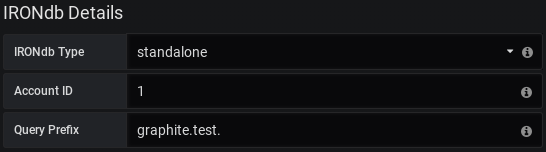
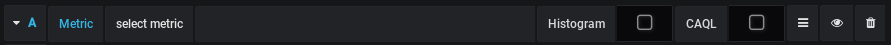
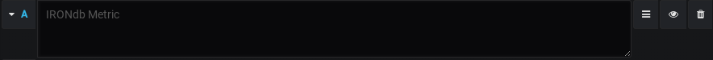
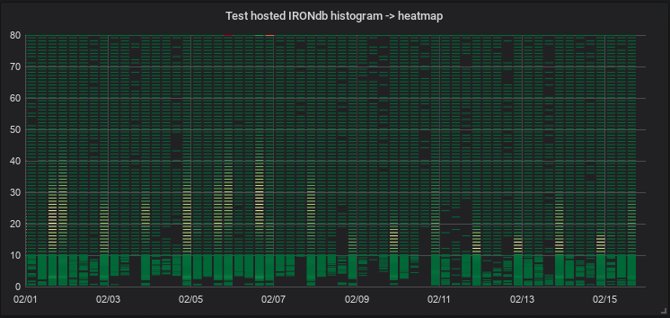
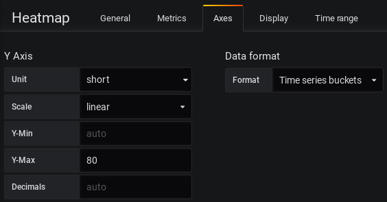
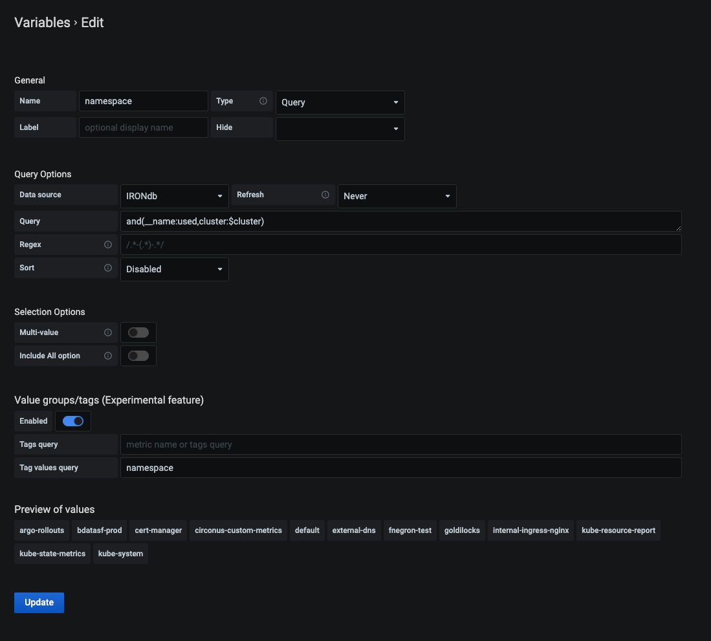

# IRONdb Datasource

This is the plugin for IRONdb 0.17.1 and newer. It is evolving and we continue to track its API.

Read more about IRONdb here:

[https://www.circonus.com/irondb/](https://www.circonus.com/irondb/)

## Quick Start
These instructions will build and run a Docker container with a Grafana instance on port 3000. There will be a pre-configured data source connected to the hosted Circonus API with a graph and alert.

1. [Install Docker](https://docs.docker.com/get-docker/)
2. [Obtain a Grafana Cloud API Key](https://grafana.com/docs/grafana-cloud/reference/create-api-key/),  needed to sign the plugin.
3. [Obtain Circonus API Token](https://docs.circonus.com/circonus/integrations/api/api-tokens/), needed to connect to the hosted Circonus API.
4. export GRAFANA_API_KEY=<From step 2>
5. export CIRCONUS_API_KEY=<From step 3>
6. git clone https://github.com/circonus-labs/circonus-irondb-datasource/
7. Execute ./docker/run-docker.sh -g $GRAFANA_API_KEY -c $CIRCONUS_API_KEY
8. Navigate to <http://localhost:3000/> to access.

## Installation
* The default location for the plugins directory is `/var/lib/grafana/plugins`, though the location may be different in your installation, see [http://docs.grafana.org/plugins/installation/](http://docs.grafana.org/plugins/installation/) for more plugin information.
* "Grafana now [requires backend plugins to be signed](https://grafana.com/docs/grafana/latest/installation/upgrading/#backend-plugins)." Or you can [turn off signature checks](https://grafana.com/docs/grafana/latest/plugins/plugin-signatures/#allow-unsigned-plugins). If you aren't sure which option is right for you, ask your security department. If you think you don't have one of those, congratulations, *you* are the security department. Read through the information linked above and choose the relevant section below.

### From Releases
1. Download the desired [release version](https://github.com/circonus-labs/circonus-irondb-datasource/releases).

2. Unzip into plugins directory.

3. Run the following commands in your shell:
  ```shell
   cd circonus-irondb-datasource
   npm install --global yarn
   yarn install
   yarn build
   export GRAFANA_API_KEY=<Obtained from: https://grafana.com/docs/grafana-cloud/reference/create-api-key/>
   export GRAFANA_TOOLKIT=$(find . -type f -iname "grafana-toolkit.js")
   node $GRAFANA_TOOLKIT plugin:sign --rootUrls http://localhost:3000/ # Change to match the URL of your Grafana install
   sudo systemctl start grafana-server # restart if already running
   ```

### From GitHub
1. Please install the following prerequisites:
   *    [Node.js](https://nodejs.org/en/download/) > 12.22.4-r0
   *    [Yarn](https://www.npmjs.com/package/yarn) > 1.22.10
   *    [Go](https://golang.org/doc/install) > 1.13.15-r0
   *    [Mage](https://github.com/magefile/mage) > 1.11.0
2. Run the following from a priveledged shell:
   ```shell
   cd /var/lib/grafana/plugins # or the location of your Grafana plugins directory
   git clone https://github.com/circonus-labs/circonus-irondb-datasource/
   cd circonus-irondb-datasource
   npm install --global yarn
   yarn install
   yarn build
   mage -v
   export GRAFANA_API_KEY=<Obtained from: https://grafana.com/docs/grafana-cloud/reference/create-api-key/>
   export GRAFANA_TOOLKIT=$(find . -type f -iname "grafana-toolkit.js")
   node $GRAFANA_TOOLKIT plugin:sign --rootUrls http://localhost:3000/ # Change to match the URL of your Grafana install
   sudo systemctl start grafana-server # restart if already running
   ```

## Configuration

1. Create a new datasource and select IRONdb from the `Type` drop down.

2. Change the IRONdb configuration options at the bottom of the datasource configuration page.


### IRONdb Type
* Standalone: An IRONdb cluster accessible directly, requires entry of Account ID.
* Hosted: An IRONdb instance hosted by Circonus, requires entry of API token.
 
### Account ID
The Account ID associated with the account to pull metrics from.

### API Token
The API Token associated with the account to pull metrics from. This can be found on your API Tokens page after logging in at [https://www.circonus.com/](https://www.circonus.com/) in the "User Profile" section.

## Usage

1. Create a new panel and set the datasource to name selected in the IRONdb datasource configuration.

### Normal Queries
For normal queries, use the metric browser to navigate the metric hierarchy of your IRONdb instance or type queries manually using the *Toggle Edit Mode* menu item to the right.


### CAQL Queries
[CAQL queries](https://login.circonus.com/resources/docs/user/CAQL.html) must be entered manually by selecting the *CAQL* checkbox or switching manually to the editor mode.


### Histograms
Histograms currently require a special checkbox to be selected in order for the returned data to be processed correctly.

Once selected, histogram data processing will be utilized for any returned data related to the specific metric.

### Heatmaps
Using the histogram checkbox to process returned data allows for histograms to be displayed on the heatmap panel type.



For this processed data to be displayed on the heatmap panel as the sample above, select *Time Series Buckets* as the Data Format to be used on the Heatmap panel.



### Template Variables

**How to configure a template variable for IRONdb**

1. From a dashboard, click `Settings` in the top right.
  
1. On the left hand side, select the `Variables` section.
  
1. Click `+New` and choose a name for your new variable.
  
1. Select the proper data source: `IRONdb`.
  
1. Under `Query`, enter the metric you wish to use in this variable (without tags), **or** enter the fully formed tag query, ala: `and(__name:foo,or(bar:baz,quux:*))`.  Note that this query can contain references to other variables (see example below)
  
1. If you enable `Include All Option`, enter `*` for the `Custom all value`.
  
1. Click `Enabled` under `Value groups/tags` to enable tags support.
  
1. Enter the tag category you wish to use in your variable under `Tag values query`.  See example below.
  
1. If you successfully completed the prior steps, `Preview of values` should now auto-complete the tag values.
  
1. Finish setup by clicking `Add` and then `Save`.

Example:



In this example, we are creating a variable called `namespace` using the query `and(__name:used,cluster:$cluster)` which contains a reference to another variable (not pictured).  We are then pulling the values out of a tag also called `namespace` (you can see the preview values).

In this way you can make dependent variables that change in a hierarchy based on prior chosen variables.
  
Your new template variable should now appear in the query builder!

# Development

The build process requires node, npm, yarn, typescrypt, and tslint

On Cent7 setup:

```
# One time setup
sudo yum install node bzip2
sudo npm install -g typescript tslint
yarn

# Build
yarn build

# Test
yarn test
```
